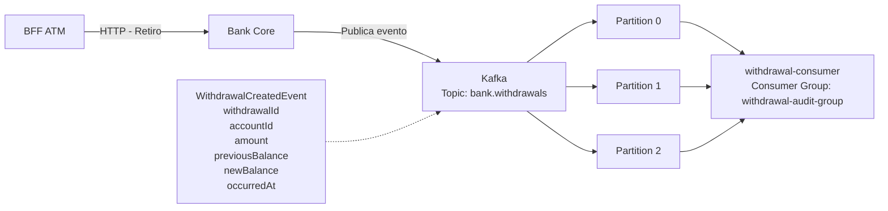

# Arquitectura de eventos

La solución utiliza una **arquitectura orientada a eventos con patrón Publish/Subscribe**. Bank Core publica un `WithdrawalCreatedEvent` en el tópico `bank.withdrawals` después de un retiro exitoso. El evento es procesado de forma asíncrona por `withdrawal-consumer`, utilizando particiones para permitir procesamiento escalable.

